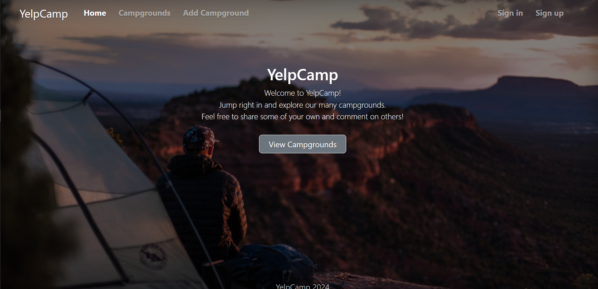
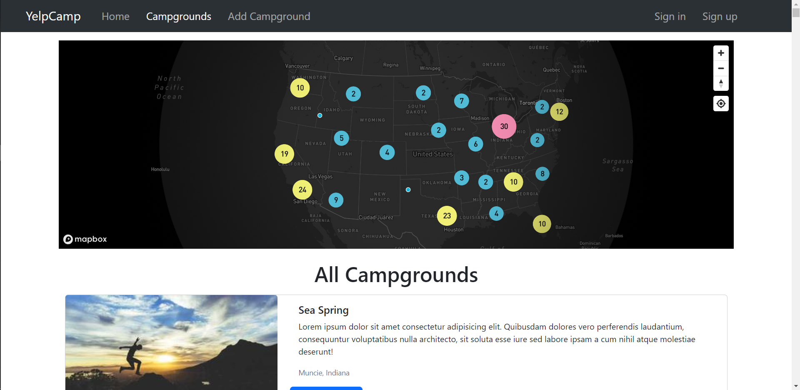
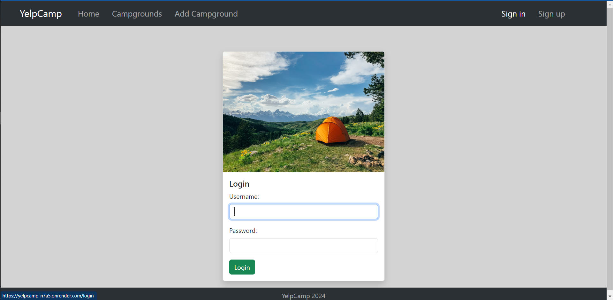
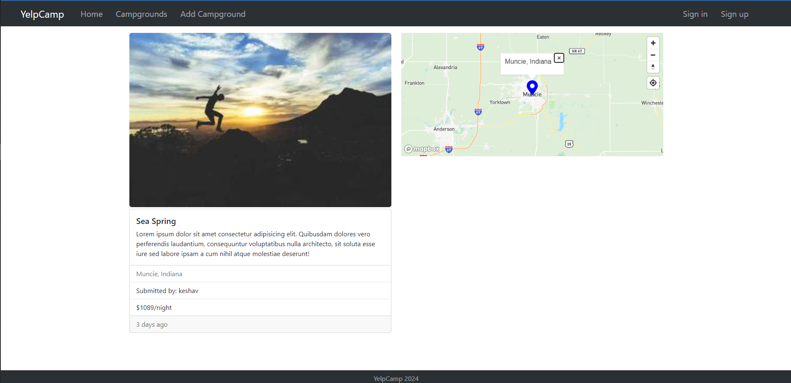

# [YelpCamp](https://yelpcamp-n7a5.onrender.com)

[](https://yelpcamp-n7a5.onrender.com)

YelpCamp is a full-stack website project where users can create and review campgrounds. This project was part of Colt Steele's web dev course on udemy.
In order to review or create a campground, you must have an account.This project was created using Node.js, Express, MongoDB, and Bootstrap.
Passport.js was used to handle authentication

## Acknowledgements

-   The skeleton of this project was based on Colt Steele's YelpCamp during the Web Development Bootcamp.

## Features

-   Everyone can view the camps and reviews without signing up or logging in.
-   Users have to login to create campgrounds and edit or remove those which are added by them
-   Users can review campgrounds, edit or remove their review
-   Users can view the location on the maps
-   All the data will pe persistent and is stored in the awazon cloud.
-   Cross platform

## Tech Stack

**Client:**

-   HTML5: markup language for creating web pages and web applications
-   CSS3: used for describing the presentation of a document written in a markup language
-   Bootstrap: free and open-source front-end web framework for designing websites and web applications quickly
-   JS: Essential for dynamic, interactive web pages and applications, enhancing user experience alongside HTML and CSS

**Server**

-   Node.js: pen-source, cross-platform JavaScript run-time environment for executing JavaScript code server-side
-   Express.js: for building web applications and APIs and connecting middleware
-   REST: REST (REpresentational State Transfer) is an architectural style for developing web services
-   MongoDB: open-source cross-platform document-oriented NoSQL database program to store details like users info, campgrounds info and comments
-   PassportJS: authentication middleware for Node.js. Extremely flexible and modular, Passport can be unobtrusively dropped in to any Express-based web application
-   MapBox: Geospatial platform for designing and publishing custom maps
-   Render: cloud platform as a service used as a web application deployment model

## Installation

### To Run this project on your system:

-   Install [MongoDB](https://www.mongodb.com/try/download/community)
    -   Logon to [mongodb atlas](https://www.mongodb.com/products/platform/atlas-database) and Create a project on mongodb atlas
-   Create a [cloudinary account](https://cloudinary.com/)

```bash
git clone https://github.com/Arceus30/yelpCamp
cd yelpcamp
npm install
```

-   Create a .env file in the root directory and define the following variables(save this file with values without any space and quotation marks):

```bash
DB_URL=
SECRET=
CLOUDINARY_CLOUD_NAME=
CLOUDINARY_KEY=
CLOUDINARY_SECRET=
MAPBOX_TOKEN=
```

-   In the terminal Run ` node app.js`
-   Now go to [localhost:3000](localhost:3000)

## Screenshots








